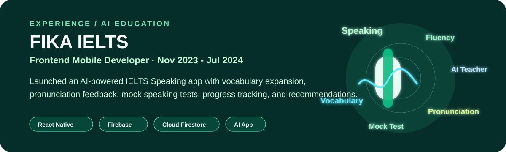

<h1 align="center">Hi, I'm Le Cong Tuan 👋</h1>

  <b>Software Engineer | Frontend Mobile Developer | UAV Ground Control Station | Real-time Systems</b>

  I build high-performance mobile and web applications, with a strong focus on React Native,
  real-time data handling, UAV systems, telemetry dashboards, and interactive user interfaces.

  

---

## 🚀 About Me

- 🔭 Currently building a **Ground Control Station app for UAV systems**
- 📡 Experienced with **MAVLink, WebSocket, TCP/UDP, and real-time telemetry**
- 📱 Strong in **React Native, TypeScript, NativeWind, Firebase**
- 🌐 Also work with **ReactJS, NextJS, VueJS, NuxtJS, Tailwind CSS**
- 🎯 Interested in **real-time systems, drone control, mobile performance, and UI engineering**

---

## 💼 Experience

 

 

---

## 🛠 Tech Stack

  

### Mobile & Frontend
React Native · ReactJS · NextJS · VueJS · NuxtJS · TypeScript · JavaScript · Tailwind CSS · NativeWind

### Backend & Realtime
NodeJS · ExpressJS · REST APIs · Socket.IO · WebSocket · TCP/UDP · Firebase · Cloud Firestore

### UAV / Systems
MAVLink · Telemetry Streaming · UAV Control · Real-time Dashboard · Ground Control Station

---

## 📌 Featured Projects

### 🛩 UAV Ground Control Station
A real-time mobile GCS application for UAV monitoring and control.

**Tech:** React Native, TypeScript, MAVLink, WebSocket/TCP/UDP, NativeWind

### 🎨 React Native Skia Kit
A Flutter-like UI Kit for React Native that renders UI components on a single Skia Canvas.

**Tech:** TypeScript, React Native, Skia, Gesture Handling

### 🧠 AI IELTS Speaking App
An AI-powered IELTS Speaking practice app with pronunciation feedback, mock tests, vocabulary expansion, and progress tracking.

**Tech:** React Native, Firebase, Cloud Firestore, REST APIs

---

## 📊 GitHub Stats

  
  

---

## 📫 Contact

- Email: **lctuan.dev@gmail.com**
- GitHub: **github.com/lctuan-duck**
